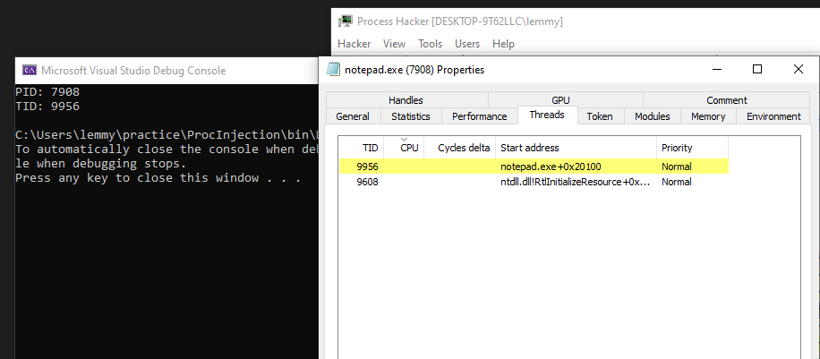
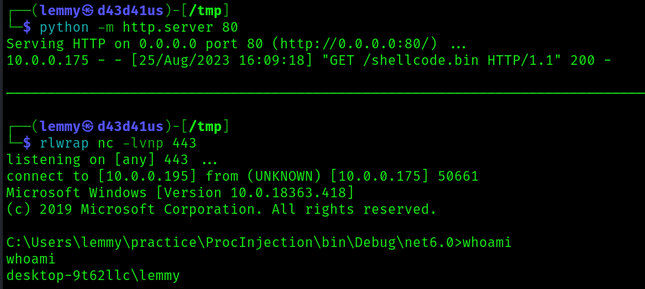

## Process Injection via QueueUserAPC

This project is a PoC of how shellcode may be injected into a process without leaving a trailing thread (containing our shellcode) that is not pointing to an exported module on disk, which is easy to discover.

Here, a Notepad process is spawned in a suspended state and space matching the length of our shellcode is created using `VirtualAlloc`. At first, this region of memory is set to Read/Write, at which point we write the shellcode here. It's then changed to Read/Execute before making a call to QueueUserAPC, executing the shellcode.

## References
- https://rastamouse.me/exploring-process-injection-opsec-part-2/
